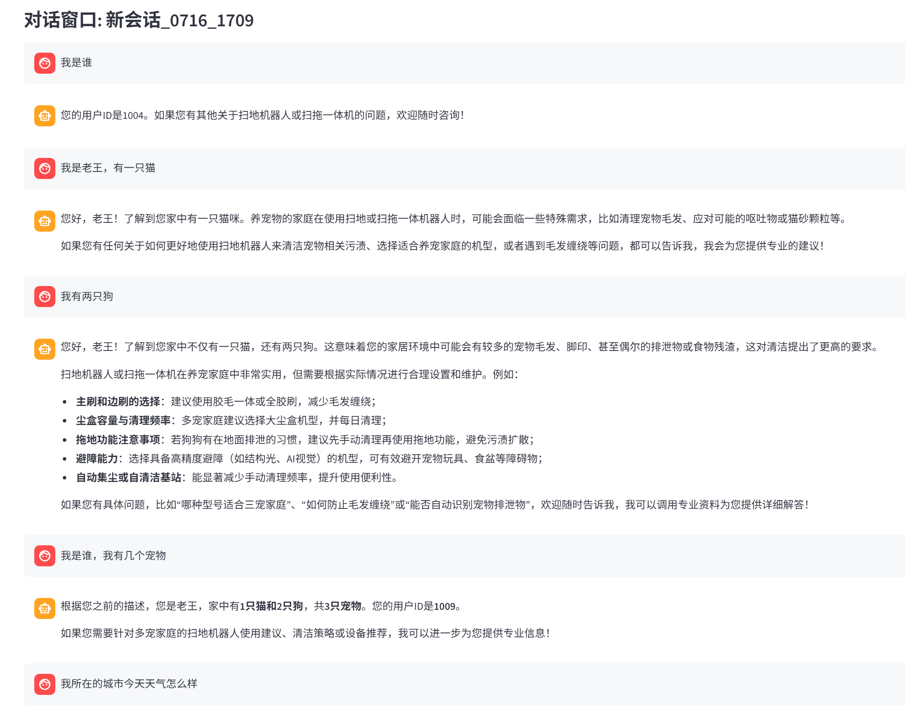
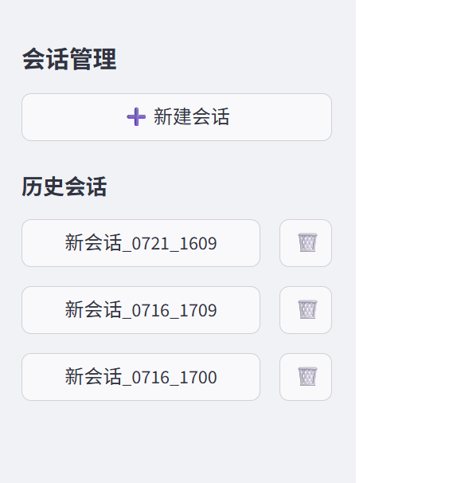
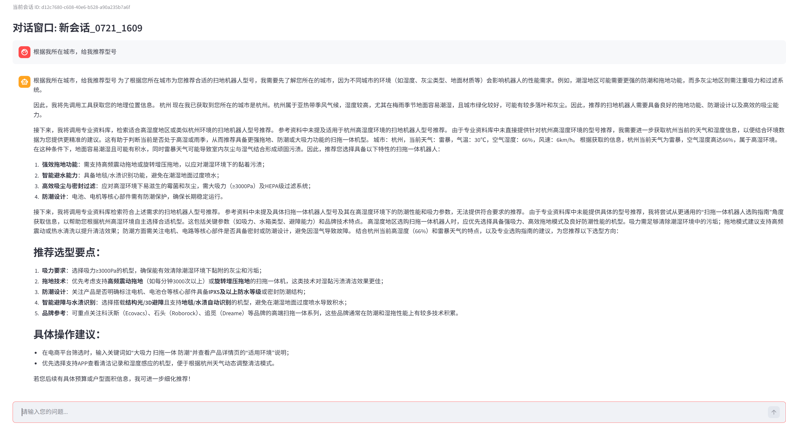
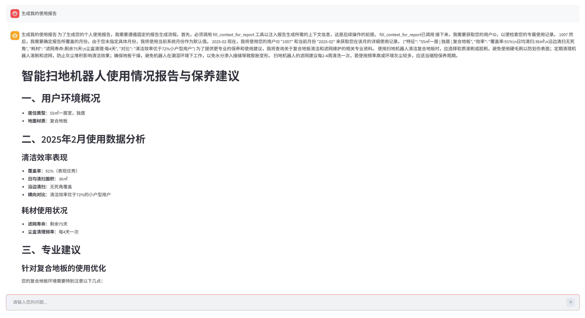

# 基于 Langchain 的扫地机器人智能客服 Agent

本项是一个专门针对扫地机器人售后与咨询场景开发的智能客服系统。项目基于 **LangChain** 框架构建，实现了具备 **多轮对话记忆持久化**、**RAG 领域知识检索**以及 **原生 Function Calling** 能力的 ReAct 架构 Agent。

## 🚀 核心功能

*   **多轮对话持久化 (Persistence)**：实现多轮对话，基于 `SqliteSaver` 实现了 Agent 状态的本地化存储。即便关闭网页或重启服务，Agent 依然能通过 `thread_id` 找回历史状态，维持对话的连贯性。
*   **会话管理 (Session Management)**：前端支持新建会话、历史会话列表展示及删除，实现了完整的会话生命周期管理。
*   **RAG 知识增强**：集成 ChromaDB 向量数据库，针对扫地机器人的故障排查、维护保养、选购建议等领域知识进行精准检索，有效解决大模型幻觉问题。
*   **动态上下文注入 (Context Injection)**：通过中间件机制，在“报告生成”等特定业务场景下自动注入上下文信息，切换提示词，提升Agent的灵活性。
*   **自定义工具开发与集成**：接入真实天气 API（wttr.in），开发并集成了RAG检索、用户数据获取、查询天气等多个工具，通过工具调用机制显著扩展了Agent的功能边界与信息获取能力。

## 🛠️ 技术栈

*   **Python**
*   **LangChian**
*   **SQLite (状态持久化), ChromaDB (向量存储)**
*   **Qwen大模型**
*   **RAG**

## 📂 项目结构

```text
├── agent/
│   ├── tools/          # 工具定义：天气获取、RAG检索、数据查询等
│   ├── middleware.py   # 中间件：日志记录、工具监控、动态提示词切换
│   └── react_agent.py  # 创建Agent 
├── data/               # 本地会话数据库 (chat_history.db)、及外部数据文件
├── model/              # 模型工厂类，适配 DashScope 接口
├── prompts/            # 系统提示词模板（包含主提示词，RAG检索提示词和生成报告提示词）
├── rag/                # RAG 服务逻辑与向量库维护
├── utils/              # 数据库处理 (db_handler)、配置加载等工具类
└── app.py              # Streamlit 前端入口
```

## 💡 技术亮点


1.  **持久化方案**：
    *   **挑战**：如何让 Agent 在不同会话间保持独立记忆，且在刷新后不丢失？
    *   **方案**：利用 `SqliteSaver` 结合 `thread_id` 机制。通过 `agent.get_state(config)` 在前端重新挂载历史消息对象，解决了“模型逻辑有记忆但 UI 不显示”的同步难题。
2. **业务流约束**：
    *   **介绍**：通过 `fill_context_for_report` 工具作为“逻辑开关”，配合中间件在特定场景下动态切换提示词，实现了强约束的报告生成流程。


## 运行结果展示
### **多轮对话记忆**：

### **会话管理**：新建对话，删除对话，历史对话信息加载，已实现会话信息本地持久化，即使重启服务，对话信息依然保留

### **工具调用**：根据用户输入的问题，一步步调用工具完成任务

### **生成报告**：调用生成报告工具，通过中间件注入上下文，加载生成报告专用提示词，约束报告格式；调用工具获取用户id，月份与使用记录（注：这里根据使用记录的数据来构造月份列表，工具默认从列表中随机获取月份，用以测试，后续可实现获取真实当前月份）



## ⚙️ 快速启动

1. **环境准备**:
   ```bash
   pip install streamlit langchain-community langchain-core langgraph python-dotenv requests
   ```
2. **配置 API Key**:
   在环境变量中设置 `DASHSCOPE_API_KEY`。
3. **运行项目**:
   ```bash
   streamlit run app.py
   ```

---

**如果您觉得这个项目对您有帮助，欢迎 Star！🌟**
